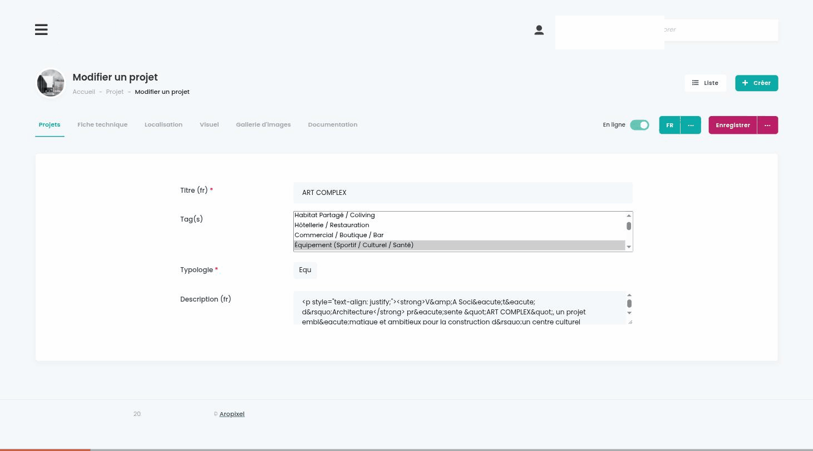
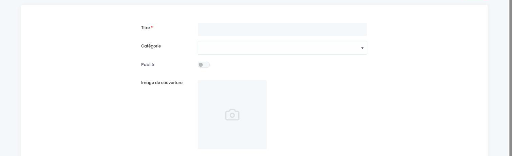
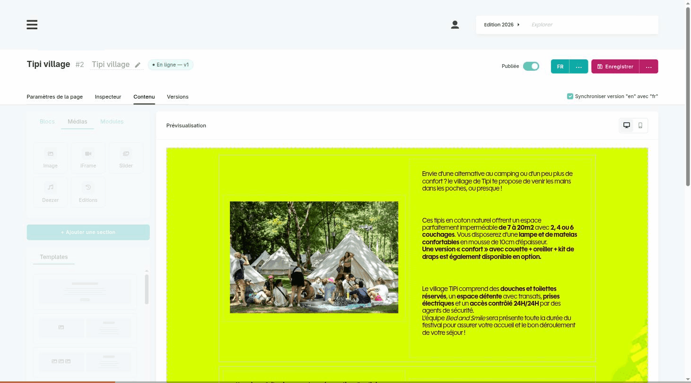

# La boîte à outils qu'on n'a plus besoin de réinventer

Notre suite Symfony, éprouvée, open source, prête pour les agents {.subtitle}

Aropixel

Solutions Symfony, plateformes événementielles et services web durables, Bordeaux

<!--
[Repère de répétition : lightning talk, 5 minutes chrono. Ne pas dépasser. Dix slides plus une optionnelle (page builder) à sauter si le chrono dépasse 4 min. make:crud n'est révélé que sur la slide agents.]

Bonjour à tous. Je suis Joel, développeur chez Aropixel, une agence à Bordeaux qui fait du Symfony depuis plus de dix ans.

Je vais vous parler de notre suite de bundles d'administration open source.
-->

---
layout: statement
---

# Un nouveau projet Symfony ?

Un nouveau back-office à coder.

<!--
Chaque projet qu'on livre a besoin d'un espace d'administration : gérer des contenus, des utilisateurs, des droits, des médias.

Et pendant longtemps, on a fait comme tout le monde : on recode un bout de back-office à chaque fois. Des formulaires, des CRUD, des uploads d'images, encore, et encore.
-->

---
layout: statement
---

# Chez nous, plus depuis longtemps.

<!--
Ça fait plus de dix ans qu'on n'a plus ce problème.

On a extrait cette brique une bonne fois pour toutes, on l'a affinée projet après projet, et on l'a rendue open source.
-->

---

<div class="kicker">Notre suite</div>

# 4 bundles, une seule philosophie

<div class="grid grid-cols-2 gap-4 mt-6">
  <div class="aro-card">
    <h4>Admin</h4>
    <p>Le cœur : back-office léger et extensible, <code>make:crud</code>, et des layout de formulaires.</p>
  </div>
  <div class="aro-card">
    <h4>Pages</h4>
    <p>Gestion de pages structurées, page builder, alternative légère aux CMS.</p>
  </div>
  <div class="aro-card">
    <h4>Blog</h4>
    <p>Actualités et articles, intégrable à toute application Symfony existante.</p>
  </div>
  <div class="aro-card">
    <h4>Menu</h4>
    <p>Navigation en drag & drop, multi-niveaux.</p>
  </div>
</div>

<p class="mt-6 text-sm opacity-70">Licence MIT · compatibles PHP 8.5 & Symfony 8 · maintenus en continu</p>

<!--
Concrètement, c'est quatre bundles : 
- Admin, qui est le cœur du pilotage, avec un générateur de CRUD, des FormTypes et leurs layouts prêts à l'emploi. 
- Pages, pour du contenu structuré façon page builder. 
- Blog, pour l'éditorial. 
- Et Menu, pour la navigation en drag & drop.

Tout est en licence MIT, compatible avec les dernières versions de PHP et Symfony, et surtout : c'est ce qu'on utilise en production, sur tous nos projets, donc c'est éprouvé.
-->

---

<div class="kicker">À quoi ça ressemble</div>

# Un back-office complet



<p class="mt-3 text-sm opacity-75">Listing avec tri et recherche · formulaires à onglets · médias et recadrage · utilisateurs et rôles.</p>

<!--
Voilà à quoi ça ressemble. 

- Des listes basées sur Datatable, avec recherche et pagination. 
- Un formulaire d'édition organisé en onglets
- Gestion et rendu des images
- Gestion et rendu des relations et collections
- Editeur QuillJs embarqué 
- Les utilisateurs et les droits sont déjà là.

Rien d'exotique : c'est un back-office propre et extensible.
-->

---

<div class="kicker">Pas une black box</div>

# Ce que c'est, ce que ce n'est pas

<div class="grid grid-cols-2 gap-4 mt-4">
  <div class="aro-card">
    <h4>Ce n'est pas</h4>
    <ul class="text-sm mt-2 space-y-1">
      <li><strong>Un EasyAdmin</strong> : pas de configuration à écrire pour obtenir des écrans.</li>
      <li><strong>Une black box</strong> : rien à contourner quand vous sortez des rails.</li>
      <li><strong>Un CMS</strong> : aucun modèle de contenu imposé.</li>
    </ul>
  </div>
  <div class="aro-card">
    <h4>C'est</h4>
    <ul class="text-sm mt-2 space-y-1">
      <li><strong>Une boîte à outils</strong> pour développeurs Symfony.</li>
      <li><strong>Du code qui vit dans votre projet</strong> : vos entités, vos FormTypes, vos controllers.</li>
      <li><strong>Une fondation éprouvée</strong> : dix ans, tous nos projets.</li>
    </ul>
  </div>
</div>


<p class="mt-2 text-xs opacity-60 text-center">Garorock (festival) · Aux Portes de Bordeaux (immobilier) · V&A (architecture)</p>

<!--
Alors, soyons clairs sur ce que c'est. Ce n'est pas un EasyAdmin : vous n'écrivez pas de configuration pour décrire vos écrans. Ce n'est pas une black box, et ce n'est pas un CMS.

C'est une boîte à outils pour développeurs. Le code vit dans votre projet, dans votre Symfony : vos entités, vos FormTypes, vos controllers. Le bundle vous donne le socle et les widgets, et il s'efface. Un festival, de l'immobilier, un cabinet d'architecture : même fondation, et le métier reste dans du code ordinaire.
-->

---

<div class="kicker">Bootstrap rapide · castor-starter</div>

# Un projet en une commande

```bash
castor-starter aropixel:new:admin mon-projet --all
```

<p class="mt-2 opacity-70">Docker Starter de JoliCode · Varnish · Mailpit · bundles à la carte · déploiement Clever Cloud · skills Claude Code — tout prêt.</p>

<v-click>

```bash
castor-starter aropixel:contrib:admin ma-contrib
```

<p class="mt-2 opacity-70">Même chose pour contribuer à la suite : fork, sandbox Symfony, bundle en symlink — prêt en une commande.</p>

</v-click>

<!--
Pour démarrer, on a castor-starter, un runner de tâches Castor. Une commande, et on a un projet Symfony complet : le Docker Starter de JoliCode, le bundle Admin installé avec un compte administrateur, les bundles Page, Blog et Menu à la carte, et le déploiement Clever Cloud déjà configuré.

Et si on doit contribuer à la suite elle-même, même chose : une commande fork le bundle, monte une sandbox Symfony et l'installe en symlink. Chaque modification est visible immédiatement, sans composer update.
-->

---

<div class="kicker">La promesse</div>

# Des widgets en quelques lignes

<div class="grid grid-cols-5 gap-4 text-sm">
<div class="col-span-3">

```php
$builder
  ->add('title', TextType::class)
  ->add('category', EntityType::class, [
      'class' => Category::class,
  ])
  ->add('published', ToggleSwitchType::class)
  ->add('cover', ImageType::class);
```

</div>
<div class="col-span-2">

```twig
{{ form_row(form.title) }}
{{ form_row(form.category) }}
{{ form_row(form.published) }}
{{ form_row(form.cover) }}
```

</div>
</div>



<p class="mt-2 text-sm opacity-75">Zéro configuration, zéro JavaScript. Pareil pour galeries, fichiers, collections, éditeur riche, dates, Select2…</p>

<!--
La promesse, c'est celle-là. Un FormType Symfony ordinaire : un texte, une relation, un booléen, une image. Un template avec quatre form_row. Et le résultat : un select, un toggle, un upload avec médiathèque partagée et recadrage.

Aucune configuration en plus, aucun JavaScript à écrire. Et c'est le même principe pour les galeries, les fichiers, les collections, l'éditeur riche, les dates.
-->

---

<div class="kicker">Prête pour les agents</div>

# Agents, créez directement

```php
// Prompt : "Crée l'admin des articles avec couleur,
// éditeur riche, date de publication et tags"

// Généré : ArticleType.php
$builder
  ->add('title', TextType::class)
  ->add('mainColor', ColorType::class)         // color picker
  ->add('content', EditorType::class)          // éditeur riche
  ->add('publishedAt', DateTimeType::class)    // date picker
  ->add('tags', FilterableEntitiesType::class); // recherche AJAX
```

<div class="mt-4">

Puis **`bin/console aropixel:make:crud`** lit ce FormType et génère :

**Controller** (index, new, edit, delete) · **Listing DataTable** · **Template de formulaire**

</div>

<div class="text-sm opacity-75 mt-3">Skills Claude Code livrés par castor-starter. Agents et devs : même langage, même toolbox.</div>

<!--
Et c'est là que ça devient intéressant avec les agents. Comme tout est du Symfony ordinaire, un agent écrit le FormType exactement comme un dev. Ensuite make:crud lit ce FormType et génère le controller, le listing et le template de formulaire.

Pas de dialecte spécial, pas de couche en plus. castor-starter livre même les skills Claude Code dans le projet. C'est ça, prêt pour les agents : une toolbox qu'ils pilotent avec le même langage que nous, et qui sort du code de production.
-->

---

<div class="kicker">S'il reste du temps</div>

# PageBundle : le page builder



<p class="mt-3 text-sm opacity-75">Blocs visuels · HTML pré-rendu · pages fixes · champs SEO. Une alternative légère au CMS.</p>

<!--
[Optionnelle : à sauter si le chrono dépasse 4 min en arrivant ici.]

Un dernier mot sur PageBundle. C'est un page builder par blocs, avec du HTML pré-rendu, des pages fixes et les champs SEO. Pour la plupart de nos sites, ça remplace un CMS.
-->

---
layout: statement
---

# Merci

**github.com/aropixel** · aropixel.com

<!--
Voilà. Une toolbox éprouvée, dix ans de production, quatre bundles open source, et maintenant prête pour que les agents contribuent avec nous.

Tout est sur github.com/aropixel, en licence MIT. Venez piocher dedans, ou venez contribuer.

Merci !
-->
