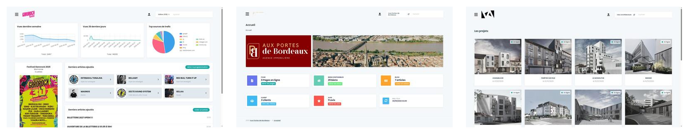

# La boîte à outils qu'on n'a plus besoin de réinventer

Notre suite Symfony, éprouvée, open source, prête pour les agents {.subtitle}

Aropixel

Solutions Symfony, plateformes événementielles et services web durables, Bordeaux

<!--
[Repère de répétition : lightning talk, 5 minutes chrono. Ne pas dépasser. Neuf slides, ~30-35s chacune en moyenne, plus de marge sur la slide anecdote (8) qui porte le message.]

Bonjour à tous. Je suis Antoine, développeur chez Aropixel, une agence à Bordeaux qui fait du Symfony depuis plus de dix ans.

Je vais vous parler cinq minutes d'un truc pas très sexy sur le papier : notre suite de bundles d'administration. Mais promis, il y a une bonne histoire à la fin.
-->

---
layout: statement
---

# Un nouveau projet Symfony ?

Un nouveau back-office à coder.

<!--
Chaque projet qu'on livre a besoin d'un espace d'administration : gérer des contenus, des utilisateurs, des droits, des médias.

Et pendant longtemps, on a fait comme tout le monde : on recode un bout de back-office à chaque fois. Des formulaires, des CRUD, des uploads d'images, encore, et encore.
-->

---
layout: statement
---

# Chez nous, plus depuis longtemps.

<!--
Ça fait plus de dix ans qu'on n'a plus ce problème.

On a extrait cette brique une bonne fois pour toutes, on l'a affinée projet après projet, et on l'a rendue open source.
-->

---

<div class="kicker">Notre suite</div>

# 4 bundles, une seule philosophie

<div class="grid grid-cols-2 gap-4 mt-6">
  <div class="aro-card">
    <h4>Admin</h4>
    <p>Le cœur : back-office léger et extensible, <code>make:crud</code>, formulaires prêts à l'emploi.</p>
  </div>
  <div class="aro-card">
    <h4>Pages</h4>
    <p>Gestion de pages structurées, page builder, alternative légère aux CMS.</p>
  </div>
  <div class="aro-card">
    <h4>Blog</h4>
    <p>Actualités et articles, intégrable à toute application Symfony existante.</p>
  </div>
  <div class="aro-card">
    <h4>Menu</h4>
    <p>Navigation en drag & drop, multi-niveaux.</p>
  </div>
</div>

<p class="mt-6 text-sm opacity-70">Licence MIT · compatibles PHP 8.5 & Symfony 8 · maintenus en continu</p>

<!--
Concrètement, c'est quatre bundles : Admin, qui est le cœur du pilotage, avec un générateur de CRUD et des FormTypes prêts à l'emploi. Pages, pour du contenu structuré façon page builder. Blog, pour l'éditorial. Et Menu, pour la navigation en drag & drop.

Tout est en licence MIT, compatible avec les dernières versions de PHP et Symfony, et surtout : c'est ce qu'on utilise en production, sur tous nos projets, pas une vitrine.
-->

---

<div class="kicker">Adaptable à chaque client</div>

# Tout est configurable



<div class="mt-4 text-sm">

**Configuration YAML** — Logo · Couleurs · Serveur mail · Intégrations · Droits d'accès · _Sans réécrire une ligne de PHP._

</div>

<!--
L'interface s'adapte à chaque client via YAML — logo, palette de couleurs, configuration du serveur de mail, integrations spécifiques — tout est réglable sans toucher au code.

Ça veut dire qu'un projet livré peut être customisé en quelques lignes de config, pas refactorisé à chaque fois.
-->

---

<div class="kicker">Le gain de temps</div>

# Un back-office, une commande

```bash
castor aropixel:new:admin mon-projet
```

<p class="mt-2 opacity-70">Docker prêt, bundles à la carte, déploiement Clever Cloud inclus.</p>

<v-click>

```bash
castor aropixel:contrib:admin ma-contrib
```

<p class="mt-2 opacity-70">Même chose, mais pour contribuer à la suite elle-même : fork, sandbox, symlink — prêt en une commande.</p>

</v-click>

<!--
Le gain de temps, il est là : une commande, et on a un projet Symfony complet, avec Docker, le bundle Admin installé d'office, et le déploiement Clever Cloud déjà configuré.

Et si on doit contribuer à la suite elle-même — corriger un bug, ajouter une fonctionnalité — même chose : une commande nous monte un environnement de contribution complet, avec le bundle en symlink. Chaque modification est visible immédiatement, sans composer update.
-->

---

<div class="kicker">Comment ça marche</div>

# FormTypes prêts à l'emploi

```php
// Entity/Article.php
#[ORM\Column(type: 'string')]
private string $mainColor;

// Form/ArticleType.php
$builder->add('mainColor', ColorType::class);
```

Template : `{{ form_widget(form.mainColor) }}` → color picker automatique.

**Color picker · Date picker · Éditeur riche · Recherche AJAX · Collections · Fichiers**

Pas de JavaScript custom à écrire. Pas de plugin vendor à intégrer.

<!--
Un FormType, c'est juste quelques lignes. On spécifie le champ, on choisit le type, et Symfony/le bundle génère le widget. Plus besoin de coder un color picker à chaque fois.

On a 13+ FormTypes prêts : couleurs, dates, time, éditeur riche, recherche AJAX, collections drag & drop, uploads de fichiers... Tout testé, tout documenté.
-->

---

<div class="kicker">Prête pour les agents</div>

# IA-ready, pas juste dans le nom

<v-clicks>

- Les **skills Claude Code** sont embarqués dans le projet dès sa création
- Cette semaine : un agent a **trouvé et corrigé 3 bugs réels**, en quelques minutes
- Autowiring cassé, collision de champs, un bug d'affichage en CSS flex — trois PR propres, scopées, testées

</v-clicks>

<!--
Et le point qui compte vraiment aujourd'hui : cette suite est pensée pour être manipulée par des agents, pas juste par des humains.

Les skills Claude Code sont embarqués dans chaque projet dès sa création. Et cette semaine, très concrètement, en retravaillant la documentation avec un agent, on a découvert trois bugs réels dans le bundle : une interface mal autowirée, une collision de rendu sur deux champs, et un bug d'affichage plus subtil — un conteneur qui s'effondrait à largeur zéro sous flexbox.

L'agent a diagnostiqué chaque cas, cloné notre environnement de contribution en une commande, appliqué le correctif, et ouvert des pull requests propres et bien scopées. Pas des rustines, de vrais fixes, au bon endroit.

C'est ça, être IA-ready : pas un slogan, une infrastructure de contribution que les agents peuvent réellement utiliser.
-->

---
layout: statement
---

# Merci

**github.com/aropixel** · aropixel.com

<!--
Voilà. Une toolbox éprouvée, dix ans de production, quatre bundles open source, et maintenant prête pour que les agents contribuent avec nous.

Tout est sur github.com/aropixel, en licence MIT. Venez piocher dedans, ou venez contribuer.

Merci !
-->
